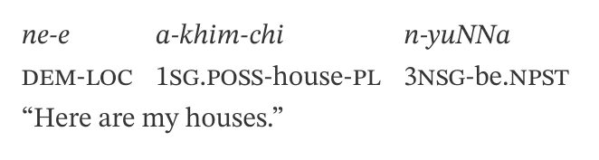
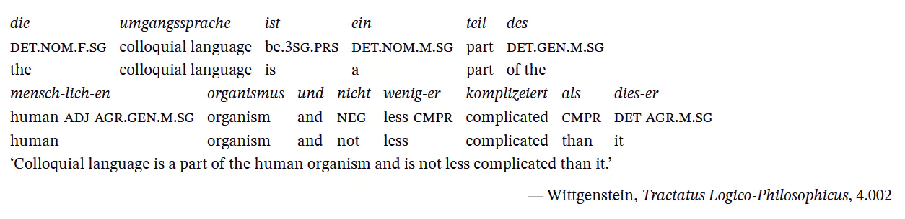

# glossing.css

A minimalist CSS library for linguistic glossing.

This stylesheet integrates best with [pandoc Markdown](https://pandoc.org/MANUAL.html)
with extension `table_captions` enabled. Yes, we use `<table>` to represent
glossings in HTML, because glossings are literally data.

With pandoc extension `table_captions`, we take contents generated into
`<caption>` as the line for translation in linguistic glossing, which is
apparently more reasonable than using table cell with `colspan` attribute.

## Building

You will need [Dart SASS](https://sass-lang.com/dart-sass). I use [clean-css](https://github.com/clean-css/clean-css)
to minify the output, but you can just skip the step. Per exemplum, 

````sh
sass glossing.scss > glossing.css
````

While I use

````sh
sass glossing.scss | cleancss -O2 > glossing.min.css
````

## Usage

Simply [download](https://github.com/mksinicus/glossing.css/releases/latest)
and include it in your HTML document with `<link rel="stylesheet" href="path/to/glossing.min.css">`.

- `.glossing > .original` is where you place the original sentence for
  glossing. Paragraph margins and paddings will fit with the glossing part.
- `.glossing.no-italic`: The first row of glossing table is not italicized.
- `.glossing.s-quotes`, `.glossing.d-quotes`: Captions (translations of the
  whole sentence) are surrounded with single quotes or double quotes
  automatically.

## Examples

Do this with pandoc Markdown:

````markdown
::: glossing

|             |                           |                      |
| ------------| --------------------------| -------------------- |
| ne-e        | a-khim-chi                | n-yuNNa              |
| **dem-loc** | **1sg.poss**-house-**pl** | **3nsg**-be.**npst** |

: 'Here are my houses.'

:::
````

This yields

````html
<div class="glossing">
<table>
<caption>‘Here are my houses.’</caption>
<tbody>
<tr class="odd">
<td>ne-e</td>
<td>a-khim-chi</td>
<td>n-yuNNa</td>
</tr>
<tr class="even">
<td><strong>dem-loc</strong></td>
<td><strong>1sg.poss</strong>-house-<strong>pl</strong></td>
<td><strong>3nsg</strong>-be.<strong>npst</strong></td>
</tr>
</tbody>
</table>
</div>
````

See the following screenshot of output (with STIX Two Text font).



And another example (contents are from [Leipzig.js](https://bdchauvette.net/leipzig.js/)),
I didn't place the source code here:



`<strong>`s are overridden to be rendered as normal-weight small capitals. Or
you can use `span.abbr` if you prefer to --- and change the source code
whenever you please, since this project is **UNLICENSED**.

## To-dos

- [x] Refactor with SCSS
- [x] minimize to a `glossing.min.css`

